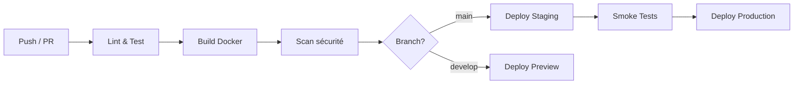

# Pipeline CI/CD — Projet Flipper

## Contexte du projet

Flipper est une borne d'arcade numérique combinant :
- Un **moteur de jeu temps réel** (Node.js + Cannon.js + Three.js, 60fps via WebSocket)
- Des **inputs hardware** (ESP32 → MQTT < 5ms)
- Une **intégration blockchain** (scores on-chain sur Solana, ~0.04€/tx)
- Un **backend Node.js** exposant REST + WebSocket
- Un **stockage hybride** (PostgreSQL pour la persistance, Redis pour le live)

Ce contexte impose des contraintes fortes sur la pipeline :
- Les tests doivent couvrir la logique métier critique (physique, score, auth wallet)
- Le build Docker doit être reproductible et léger (latence réseau = latence jeu)
- Le déploiement doit être zero-downtime (une partie peut être en cours)

---

## Étapes de la pipeline

### Vue d'ensemble

### Détail des étapes

#### 1. Lint & Test
- **ESLint** sur le code source
- **Tests unitaires** Node.js natif (`node --test`) sur la logique métier :
  - `math.js` / score calculation
  - Validation des inputs MQTT
  - Vérification des signatures Solana (mock)
- **Matrix build** : Node 18, 20, 22 pour garantir la compatibilité
- **Artefacts** : résultats de test uploadés pour traçabilité

#### 2. Build Docker (multi-stage)
- **Stage test** : exécute les tests dans le conteneur → garantit que l'image qui part en prod a passé ses tests dans le même environnement
- **Stage production** : image légère `node:20-alpine`, sans devDependencies, user non-root
- **Cache GitHub Actions** (type=gha) : réduit le temps de build sur les layers inchangées

#### 3. Scan sécurité (Trivy)
- Scan du filesystem (`fs`) sur le dossier `app/`
- Bloque le pipeline sur toute vulnérabilité `HIGH` ou `CRITICAL`
- Pertinent ici car on manipule des wallets et des transactions blockchain — une faille dans une dépendance peut compromettre les fonds des joueurs

#### 4. Infra (Terraform)
- Provisionnement et mise à jour de l'infrastructure (staging / production) via **Terraform**
- Exécution en CI sur changements `infra/terraform/` (plan), avec validation manuelle pour l'apply en production

#### 5. Deploy Staging (branche main)
- Push de l'image sur le registry (Docker Hub ou GHCR)
- Déploiement automatique sur l'environnement staging
- Aucune intervention manuelle requise

#### 6. Smoke Tests
- Vérification des endpoints critiques après déploiement :
  - `GET /health` → `{"status": "healthy"}`
  - `GET /metrics` → format Prometheus
  - `GET /` → réponse applicative
- Si un smoke test échoue → rollback automatique

#### 7. Deploy Production
- Protégé par un **environment GitHub** avec reviewers obligatoires
- Déploiement uniquement si staging est stable
- Tag de l'image avec le SHA du commit pour la traçabilité

---

## Outils choisis et justification

- **GitHub Actions** — Orchestration CI/CD : Natif GitHub, gratuit pour les repos publics, intégration directe avec le registry GHCR
- **Docker multi-stage** — Build reproductible : Isole les dépendances de test, produit une image légère pour la prod
- **Trivy** — Scan de sécurité : Gratuit, rapide, couvre les CVE des dépendances npm et de l'image Docker — critique pour un projet qui touche à des wallets
- **node --test** — Tests unitaires : Natif Node.js 18+, zéro dépendance externe, suffisant pour notre périmètre
- **ESLint** — Qualité de code : Détecte les erreurs avant runtime, particulièrement utile sur la game loop (16ms budget)
- **GHCR** — Registry d'images : Intégré GitHub, authentification via GITHUB_TOKEN sans secret supplémentaire
- **Terraform** — Infra as Code : Reproductible, versionné, permet de gérer staging/prod de manière cohérente (et reviewable via `plan`)

---

## Outils écartés et pourquoi

- **Jenkins** : Nécessite une infrastructure dédiée à maintenir. Surdimensionné pour notre équipe.
- **CircleCI / GitLab CI** : Notre code est sur GitHub — changer de plateforme CI ajoute de la friction sans bénéfice réel.
- **Jest** : Ajoute une dépendance lourde alors que `node --test` couvre notre besoin.
- **Snyk** : Payant au-delà d'un certain seuil. Trivy couvre le même périmètre gratuitement.
- **Heroku** : Pas de contrôle sur l'infrastructure, coûteux, ne supporte pas les WebSockets persistants dont on a besoin pour le game state.

---

## Enchaînement des étapes

- `commit` puis `push`
- `lint & test` (bloque si test échoue)
- `build docker` (multi-stage, cache activé)
- `scan sécurité` (bloque si CVE `HIGH`/`CRITICAL`)
- `terraform plan` (sur changements `infra/terraform/`, puis `apply` validé avant prod)
- `deploy staging` (automatique sur `main`)
- `smoke tests` (`/health`, `/metrics`, `/`)
- `deploy production` (manuel, `review requise`)

Les étapes **test**, **build** et **security** sont séquentielles et bloquantes.
Le **deploy production** est le seul point d'intervention manuelle volontaire — on veut qu'un humain valide avant de toucher à la prod d'une borne en utilisation.

---

## Contraintes spécifiques au projet Flipper

- **Zero-downtime** : le déploiement ne doit pas couper une partie en cours. À implémenter via un rolling update (Kubernetes ou Docker Swarm).
- **Secrets** : les clés de wallet et les credentials Solana ne doivent jamais apparaître dans les logs CI. Gérés via les secrets GitHub Actions.
- **Latence** : l'image de production doit rester légère. Chaque MB supplémentaire = temps de pull supplémentaire lors d'un redéploiement.